# Antigravity Skills Platform

[](#)
[](#)
[](#)

A comprehensive, highly optimized ecosystem of agent skills and global workflows developed for the **Antigravity** AI coding assistant. This repository acts as a persistent memory and capability engine, allowing the agent to perform advanced, specialized tasks—ranging from zero-bug test-driven development to hyper-detailed SEO site auditing and high-fidelity UI redesigns—with perfect context alignment and zero drift.

---

## Features

- **62 Production-Grade Skills**: Fully documented instructions and helper tools across engineering, UI design, generative search optimization, and automated workflow coordination.
- **Self-Documenting & Agent-Searchable**: Built to be fully discoverable via AST-based tools and NLP semantic mapping.
- **Advanced Design Systems**: Tailored integrations with the Stitch Visual Engine to output beautiful, custom web interfaces with strict style guidelines.
- **Parallel Subagent Workflows**: Built-in support for orchestrating multi-agent parallel operations for complex tasks like full-site SEO audits.

---

## System Architecture & Data Flows

The following architecture diagram visualizes how the Antigravity Agent coordinates, selects, and executes specialized skills in response to a user request, alongside their integrations with external services.

```mermaid
%% Legend: color=layer
graph TD
    classDef actor fill:#e1f5fe,stroke:#0288d1,stroke-width:2px,color:#01579b;
    classDef agent fill:#ede7f6,stroke:#7e57c2,stroke-width:2px,color:#4a148c;
    classDef core fill:#e8f5e9,stroke:#4caf50,stroke-width:2px,color:#1b5e20;
    classDef dev fill:#fff3e0,stroke:#ff9800,stroke-width:2px,color:#e65100;
    classDef ui fill:#fbe9e7,stroke:#e64a19,stroke-width:2px,color:#bf360c;
    classDef seo fill:#fffde7,stroke:#fbc02d,stroke-width:2px,color:#f57f17;
    classDef ext fill:#eceff1,stroke:#607d8b,stroke-width:2px,color:#263238;

    subgraph UserInteraction ["User & Agent Orchestration"]
        user["User Request<br/>(Natural Language / Slash Commands)"]:::actor
        agent["Antigravity Agent<br/>(Task Dispatcher & Runner)"]:::agent
    end

    subgraph CoreSkills ["Core Execution & Quality Control"]
        superpowers["using-superpowers<br/>(Capability Bootstrap)"]:::core
        brainstorming["brainstorming<br/>(Intent Exploration)"]:::core
        plans["writing-plans<br/>(Architectural Planning)"]:::core
        executing["executing-plans<br/>(Milestone Tracking)"]:::core
        debugging["systematic-debugging<br/>(Scientific Bug Hunting)"]:::core
        verification["verification-before-completion<br/>(Zero-Bug Verification)"]:::core
        human["write-like-a-human<br/>(Natural Prose Formatting)"]:::core
    end

    subgraph DevSkills ["Developer Workflow & Documentation"]
        blueprint["codebase-to-blueprint<br/>(Exhaustive Project Mapping)"]:::dev
        refactor["code-refactor<br/>(SOLID Architecture Cleaning)"]:::dev
        readmeSync["readme-sync<br/>(Architecture Doc Generation)"]:::dev
        smartCommit["smart-commit<br/>(Atomic Git Automation)"]:::dev
        handoff["handoff<br/>(Session State Continuity)"]:::dev
    end

    subgraph StitchSkills ["UI, UX & Visual Engine (Stitch)"]
        stitchDesign["stitch-design<br/>(Prompt & Theme Tuning)"]:::ui
        stitchLoop["stitch-loop<br/>(Autonomous Site Building)"]:::ui
        tasteDesign["taste-design<br/>(Premium UI Guidelines)"]:::ui
        reactComp["react-components<br/>(Modular Frontend AST Verification)"]:::ui
        uiRedesign["ui-redesign-orchestrator<br/>(Phase-Driven Redesigns)"]:::ui
    end

    subgraph SEOSkills ["SEO Strategy & Optimization"]
        seo["seo<br/>(Core SEO Dashboard)"]:::seo
        seoAudit["seo-audit<br/>(Parallel Audit Specialist Coordinator)"]:::seo
        seoTechnical["seo-technical<br/>(Crawlability & Core Web Vitals)"]:::seo
        seoGeo["seo-geo<br/>(Generative Engine Visibility)"]:::seo
        seoMaps["seo-maps<br/>(Geo-Grid & GBP Profile Sync)"]:::seo
    end

    subgraph ExternalServices ["External Engines & Integrations"]
        ctx7["Context7 API<br/>(Real-time Library Documentation)"]:::ext
        dataForSeo["DataForSEO API<br/>(Live Search & Competitor Intelligence)"]:::ext
        googleApi["Google APIs<br/>(Search Console & Analytics 4)"]:::ext
    end

    %% Roles to Routers
    user -->|"Asks question / provides code"| agent
    agent -->|"Bootstraps workspace context"| superpowers
    superpowers -.->|"Loads relevant skills"| agent

    %% Core Flow Connections
    agent -->|"1. Analyze Requirements"| brainstorming
    brainstorming -->|"2. Create Spec"| plans
    plans -->|"3. Implement Tasks"| executing
    executing -->|"4. Resolve Errors"| debugging
    executing -->|"5. Double Check Quality"| verification
    verification -->|"6. Format Output"| human

    %% Developer Flow
    agent -->|"Run Codebase Audit"| blueprint
    agent -->|"Clean & Restructure"| refactor
    agent -->|"Document Codebase"| readmeSync
    agent -->|"Commit Changes"| smartCommit
    agent -->|"Save Context"| handoff

    %% UI Design Flow
    agent -->|"Craft UI Layouts"| stitchDesign
    stitchDesign -->|"Stitch Visual Loop"| stitchLoop
    stitchDesign -->|"Verify CSS Variables"| tasteDesign
    stitchDesign -->|"React Component Gen"| reactComp
    agent -->|"Redesign Request"| uiRedesign

    %% SEO Flow
    agent -->|"SEO Audit Request"| seoAudit
    seoAudit -->|"Coordinates Sub-auditors"| seo
    seoAudit -->|"Checks Site Tech"| seoTechnical
    seoAudit -->|"Analyzes AI Citations"| seoGeo
    seoAudit -->|"Maps Local Radius"| seoMaps

    %% External Connections
    readmeSync -.->|"Query library docs"| ctx7
    seoMaps -.->|"Fetch Maps Rankings"| dataForSeo
    seoTechnical -.->|"Fetch CrUX CWV Metrics"| googleApi
```



---

## Technology Stack

| Component | Standard / Technology | Description |
|---|---|---|
| **Core Documentation** | Markdown (CommonMark) | Machine-readable, semantic instructions for agent parsers. |
| **Frontmatter Schema** | YAML Frontmatter | Metadata tags (`name`, `description`) for skill indexing. |
| **Automation Scripts** | Node.js (JavaScript), PowerShell, Bash | Specialized helper scripts for programmatic audits and integrations. |
| **Visual Flowcharts** | Mermaid.js | Graph definitions embedded directly in markdown for architecture visuals. |

---

## Complete Skills Index

### 1. Core Quality & Control Skills
| Folder | Name | Purpose / Trigger | Description |
|---|---|---|---|
| [`brainstorming`](./brainstorming) | `brainstorming` | Before creative/feature work | Explores user intent, requirements, and design before implementation. |
| [`using-superpowers`](./using-superpowers) | `using-superpowers` | Conversation startup | Establishes how to find and use skills, requiring Skill tool invocation before any response. |
| [`writing-plans`](./writing-plans) | `writing-plans` | Complex specs/requirements | Design implementation plans before touching code. |
| [`executing-plans`](./executing-plans) | `executing-plans` | Executing active plans | Guidelines for executing written plans with review checkpoints. |
| [`systematic-debugging`](./systematic-debugging) | `systematic-debugging` | Bugs/errors/test failures | Scientific debugging process before proposing fixes. |
| [`verification-before-completion`](./verification-before-completion) | `verification-before-completion` | Before claiming success | Requires running verification commands and confirming evidence before assertions. |
| [`write-like-a-human`](./write-like-a-human) | `write-like-a-human` | Output formatting | Enforces natural, human-like writing by removing AI patterns and filler. |
| [`focus-redirect`](./focus-redirect) | `focus-redirect` | Proactive self-check | Automatically redirects focus back to the user's original goal if drifting occurs. |
| [`get-shit-done`](./get-shit-done) | `get-shit-done` | Spec-driven dev | Structured project planning and context engineering framework. |

### 2. Developer & Documentation Workflow Skills
| Folder | Name | Purpose / Trigger | Description |
|---|---|---|---|
| [`codebase-to-blueprint`](./codebase-to-blueprint) | `codebase-to-blueprint` | Codebase documentation | Performs exhaustive analysis of a codebase and produces a single self-contained `BLUEPRINT.md` reconstruction guide. |
| [`code-refactor`](./code-refactor) | `code-refactor` | Refactoring messy/monolithic code | Refactors messy or poorly structured codebases into production-grade professional code without altering business logic. |
| [`readme-sync`](./readme-sync) | `readme-sync` | Outdated/missing README | Analyzes a codebase and writes/updates `README.md` with detailed embedded Mermaid architecture flowcharts. |
| [`smart-commit`](./smart-commit) | `smart-commit` | Committing multiple changes | Analyzes changed files, groups them logically, and commits them atomically using Conventional Commits. |
| [`handoff`](./handoff) | `handoff` | Context switching/saving | Creates or updates `HANDOFF.md` to capture current state and ensure continuity. |
| [`find-skills`](./find-skills) | `find-skills` | Skill discovery/installation | Helps discover and install agent skills when matching user queries. |
| [`writing-skills`](./writing-skills) | `writing-skills` | Creating/modifying skills | Guidance on creating, editing, and verifying agent skills before deployment. |
| [`finishing-a-development-branch`](./finishing-a-development-branch) | `finishing-a-development-branch` | Branch integration | Guides merge, PR, or cleanup decisions once implementation is complete. |
| [`requesting-code-review`](./requesting-code-review) | `requesting-code-review` | Requesting PR feedback | Formulates structured review requests when completing tasks. |
| [`receiving-code-review`](./receiving-code-review) | `receiving-code-review` | Addressing PR feedback | Rigorous, non-performative verification guidelines for addressing review comments. |
| [`test-driven-development`](./test-driven-development) | `test-driven-development` | Implementing features/bugfixes | Enforces red-green-refactor testing principles before writing production code. |
| [`dispatching-parallel-agents`](./dispatching-parallel-agents) | `dispatching-parallel-agents` | Multi-tasking parallel execution | Guidelines for delegating independent tasks to parallel agent contexts. |

### 3. Stitch, UI & Visual Design Skills
| Folder | Name | Purpose / Trigger | Description |
|---|---|---|---|
| [`stitch-design`](./stitch-design) | `stitch-design` | Stitch design work | Unified entry point for prompt enhancement, design system synthesis, and screen editing via Stitch. |
| [`stitch-enhance-prompt`](./stitch-enhance-prompt) | `stitch-enhance-prompt` | Enhancing UI prompts | Transforms vague UI ideas into highly specific, Stitch-optimized prompts. |
| [`stitch-loop`](./stitch-loop) | `stitch-loop` | Autonomous site building | Iteratively builds websites using Stitch with an autonomous baton-passing pattern. |
| [`taste-design`](./taste-design) | `taste-design` | Semantic design systems | Generates agent-friendly `DESIGN.md` files enforcing strict premium, anti-generic UI standards. |
| [`design-md`](./design-md) | `design-md` | Design system extraction | Synthesizes Stitch projects' semantic design systems into `DESIGN.md` files. |
| [`extract-design`](./extract-design) | `extract-design` | Design language parsing | Extracts full design language from any website URL, producing Tailwind, CSS variables, React themes, and accessibility scores. |
| [`frontend-design`](./frontend-design) | `frontend-design` | Frontend interface building | Creates distinctive, production-grade frontend interfaces with curated HSL color palettes and micro-animations. |
| [`react-components`](./react-components) | `react-components` | React component compiler | Converts Stitch designs into modular Vite and React components with AST-based validation. |
| [`remotion`](./remotion) | `remotion` | Visual walkthrough video gen | Generates smooth walkthrough videos from Stitch screens using Remotion with text overlays. |
| [`ui-redesign-orchestrator`](./ui-redesign-orchestrator) | `ui-redesign-orchestrator` | Structured UI redesigns | Orchestrates phase-driven redesign workflows (constraint gathering + direction proposals). |
| [`shadcn-ui`](./shadcn-ui) | `shadcn-ui` | shadcn/ui integration | Expert guidance for integrating, installing, and customizing shadcn/ui components. |

### 4. SEO & Growth Strategy Skills
| Folder | Name | Purpose / Trigger | Description |
|---|---|---|---|
| [`seo`](./seo) | `seo` | General SEO analysis | Core SEO dashboard for comprehensive organic search audits, Core Web Vitals, and schema tags. |
| [`seo-audit`](./seo-audit) | `seo-audit` | Complete website audit | Full site crawl (up to 500 pages) delegating tasks to 10 parallel specialist subagents. |
| [`seo-technical`](./seo-technical) | `seo-technical` | Crawlability & Speed | Technical audit across crawlability, security, mobile, and IndexNow protocols. |
| [`seo-content`](./seo-content) | `seo-content` | Content quality/E-E-A-T | Evaluates passage quality, thin content, readability, and citation readiness. |
| [`seo-geo`](./seo-geo) | `seo-geo` | Generative Engine Optimization | Optimizes content for AI Overviews, Perplexity, and ChatGPT search citations. |
| [`seo-local`](./seo-local) | `seo-local` | GBP & Citation consistency | Reviews NAP consistency and Google Business Profile configurations for hybrid/local businesses. |
| [`seo-maps`](./seo-maps) | `seo-maps` | Geo-grid & reviews | Maps intelligence using geo-grid rank tracking, review velocity, and Overpass API data. |
| [`seo-images`](./seo-images) | `seo-images` | Image size & alt tags | Minimizes WebP/AVIF file sizes, writes descriptive alt text, and formats responsive images. |
| [`seo-schema`](./seo-schema) | `seo-schema` | JSON-LD schema generation | Generates valid Schema.org structured data (Organization, LocalBusiness, FAQ, etc.). |
| [`seo-sitemap`](./seo-sitemap) | `seo-sitemap` | XML sitemap validation | Builds or audits XML sitemaps to ensure clean crawling routes. |
| [`seo-backlinks`](./seo-backlinks) | `seo-backlinks` | Link profiles & domains | Analyzes anchor distributions, toxic domains, and competitor link gaps. |
| [`seo-competitor-pages`](./seo-competitor-pages) | `seo-competitor-pages` | "X vs Y" landing pages | Formulates comparison templates and alternatives matrices. |
| [`seo-programmatic`](./seo-programmatic) | `seo-programmatic` | Automated page scaling | Controls templates, internal link maps, and safeguards against index bloat. |
| [`seo-plan`](./seo-plan) | `seo-plan` | SEO Strategy roadmaps | Standardized roadmaps and content calendars for long-term organic growth. |
| [`seo-image-gen`](./seo-image-gen) | `seo-image-gen` | AI image generation for SEO | Crafts open-graph, hero, and schema images using Gemini via MCP integrations. |

### 5. Integrations & MCP Capabilities
| Folder | Name | Purpose / Trigger | Description |
|---|---|---|---|
| [`context7-cli`](./context7-cli) | `context7-cli` | Context7 setup/CLI | Quick reference for managing OAuth, keys, and skill installation via ctx7 CLI. |
| [`context7-mcp`](./context7-mcp) | `context7-mcp` | Direct docs querying | Model Context Protocol gateway for library search and snippet loading. |
| [`find-docs`](./find-docs) | `find-docs` | Developer API lookups | Fetches real-time, verified API references for external dependencies. |
| [`seo-dataforseo`](./seo-dataforseo) | `seo-dataforseo` | Live SERP/Keyword data | Fetches live Search Engine Results Page metrics, keyword volumes, and AI visibility. |
| [`seo-google`](./seo-google) | `seo-google` | Search Console & Analytics | Integrates real GSC analytics, CrUX field history, and GA4 organic traffic. |
| [`nlm-skill`](./nlm-skill) | `nlm-skill` | NotebookLM automation | Programmatic management of Google NotebookLM sources, podcasts, and summaries. |
| [`caveman`](./caveman) | `caveman` | Ultra-compressed conversation | Extreme token saving communication layer that speaks in a caveman dialect. |
| [`caveman-commit`](./caveman-commit) | `caveman-commit` | Compressed git commits | High-signal, minimum-token Conventional Commit message generator. |
| [`caveman-compress`](./caveman-compress) | `caveman-compress` | File memory compression | Compresses natural language files (e.g., CLAUDE.md) into compressed formats. |
| [`caveman-review`](./caveman-review) | `caveman-review` | Ultra-compressed PR comments | Delivers PR review comments in one-line ultra-brief statements. |
| [`caveman-help`](./caveman-help) | `caveman-help` | Caveman command index | Quick reference command card for all caveman configurations. |

---

## Project Structure

An annotated map of the `antigravity-skills` repository structure:

```text
.
├── .git/                            # Local git configuration
├── brainstorming/                   # Feature design & requirement analysis skill
├── caveman/                         # Ultra-compressed lite/full/ultra token-saving speech
├── caveman-commit/                  # Ultra-compressed commit message compiler
├── caveman-compress/                # Context compression system for memory files
├── caveman-help/                    # Help card index for caveman commands
├── caveman-review/                  # High-signal, low-token code review comments
├── code-refactor/                   # SOLID principles-based architectural reorganization
├── codebase-to-blueprint/           # AI-reconstruction blueprint generator
├── context7-cli/                    # ctx7 command-line integration tools
├── context7-mcp/                    # Context7 MCP server bindings
├── design-md/                       # Stitch visual project DESIGN.md generator
├── dispatching-parallel-agents/     # Concurrent subagent task delegation
├── executing-plans/                 # Structured plan tracking & execution checklists
├── extract-design/                  # Complete visual theme extraction from target URLs
├── find-docs/                       # Context7-based real-time framework API lookup
├── find-skills/                     # Interactive skill locator & installer
├── finishing-a-development-branch/  # Merging, clean-up & PR guidelines
├── focus-redirect/                  # Proactive context monitoring & drift prevention
├── frontend-design/                 # High-fidelity custom styling & micro-animations
├── get-shit-done/                   # Spec-driven context & plan orchestrator
├── graphify/                        # Visual knowledge graph pipeline generator
├── handoff/                         # State-saving handoff generator for model continuity
├── nlm-skill/                       # NotebookLM automation and CLI guides
├── react-components/                # AST-validated Stitch-to-React component compiler
├── readme-sync/                     # Mermaid-driven architecture and documentation sync
├── receiving-code-review/           # Technical rigor checklists for addressing reviews
├── remotion/                        # Premium screen-recording video generator
├── requesting-code-review/          # Formatting checklists for submitting code reviews
├── seo/                             # Central search dashboard and technical auditor
├── seo-audit/                       # 10-specialist parallel crawl coordinator
├── seo-backlinks/                   # Toxic link & competitor gap profile checker
├── seo-competitor-pages/            # Competitor feature comparison page templates
├── seo-content/                     # E-E-A-T validation and citability parser
├── seo-dataforseo/                  # DataForSEO live keyword and AI Overview scraper
├── seo-geo/                         # Generative Engine Optimization (GEO) & citations
├── seo-google/                      # Direct Search Console & PageSpeed Insights connector
├── seo-hreflang/                    # International SEO multi-language tag builder
├── seo-image-gen/                   # SEO open-graph & hero image designer
├── seo-images/                      # WebP/AVIF file optimizer and responsive alt parser
├── seo-local/                       # NAP verification and LocalBusiness schemas
├── seo-maps/                        # Geo-grid map tracking & GBP review harvester
├── seo-page/                        # Single-URL performance and meta auditing
├── seo-plan/                        # Multi-quarter organic growth content calendars
├── seo-programmatic/                # Automated thin-content prevention at scale
├── seo-schema/                      # Strict JSON-LD Schema.org compiler
├── seo-sitemap/                     # XML sitemap validators and crawlers
├── seo-technical/                   # Core Web Vitals (INP/LCP/CLS) audit engine
├── shadcn-ui/                       # shadcn component layout and CLI setup
├── smart-commit/                    # Automated atomic git staging & commit workflow
├── stitch-design/                   # Stitch visual canvas entry point and prompts
├── stitch-enhance-prompt/           # Natural language-to-Stitch prompt compiler
├── stitch-loop/                     # Autonomous web development iterative pipeline
├── subagent-driven-development/     # Current-session parallel subagent controller
├── systematic-debugging/            # Hypothesis-driven scientific issue debugging
├── taste-design/                    # Strict premium design guidelines
├── test-driven-development/         # Red-green-refactor unit testing engine
├── ui-redesign-orchestrator/        # Phase-based visual layout redesign coordinator
├── using-superpowers/               # Session bootstrap & mandatory capability checker
├── verification-before-completion/  # Post-execution zero-bug validation checks
├── write-like-a-human/              # AI-debiasing writing engine
├── writing-plans/                   # Step-by-step engineering plan templates
└── writing-skills/                  # New skill validation & lint check rules
```

---

## Environment Variables

While the root skills repository itself does not run directly, individual skills leverage key environment credentials to connect to external APIs and MCP services:

| Variable Name | Required By | Default | Description |
|---|---|---|---|
| `CONTEXT7_API_KEY` | `find-docs`, `context7-mcp` | `None` | API key to increase rate limits for Context7 documentation lookup. |
| `DATAFORSEO_API_KEY` | `seo-dataforseo`, `seo-maps` | `None` | Authentication key for DataForSEO live rank tracking and maps scraper. |
| `GOOGLE_SEARCH_CONSOLE_CREDENTIALS` | `seo-google` | `None` | Service Account JSON or OAuth credential path for fetching organic keyword metrics. |
| `GOOGLE_ANALYTICS_CREDENTIALS` | `seo-google` | `None` | Credentials to parse active organic page conversions inside GA4. |

---

## Getting Started

### Prerequisites

1. **Antigravity Coding Assistant**: The runner or local workspace agent configured to load and run skill files.
2. **Terminal Shell**: PowerShell (Windows) or Bash (macOS/Linux) to execute skill-specific automation scripts.

### Installation

To load the skills platform into your local Antigravity installation:

1. Clone or download this repository to your target local application data path:
   ```bash
   # Copy directory contents to the local agent skills repository
   cp -r . "<your_user_dir>\.gemini\antigravity\skills"
   ```
2. Restart the Antigravity session to allow the bootstrap module (`using-superpowers`) to discover and index the full directory of skills.

---

## Verification & Testing

To verify the integrity and format compliance of all loaded skills:

1. Run the skill schema validator located in the `writing-skills` library:
   ```bash
   # Execute skill file frontmatter and structure sanity checks
   powershell -File ".\writing-skills\scripts\validate-skills.ps1"
   ```
2. Check the validation results to ensure every `SKILL.md` is correctly structured and completely indexed.
